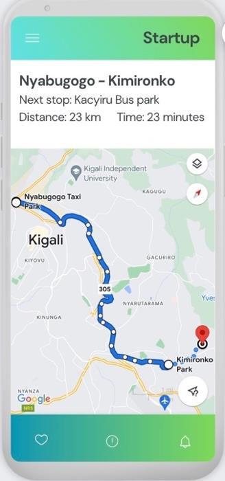

# Driving Track Project

[Driving Track](https://driving-track.vercel.app) is a simple application that provides the real-time navigation for driver, especially those using public transportation.it utilizes the google maps api to fetch routes and information related to them, and displays it to the user (UI) interface. however, it's all about simulation of real world scenario in absence of using GPS or any Driver's device location service

## Application features

1. Uses pre-defined bus stops with a help of Google Maps Directions API
2. Displays routes and information related to them with Marker at each bus stop
3. Simulates the moving bus within the entire route

## Installation

1. To run this application to your local computer:

### `git clone https://github.com/bonane123/driving-track.git`

2. Navigate into project directory

### `cd driving-track`

3. Install required dependencies using npm

### `npm install`

4. Get Google Maps API from [Google cloud console ](https://console.cloud.google.com/welcome)

5. Create .env file and configure it by adding Google Maps API key

### `REACT_APP_GOOGLE_MAP_API_KEY=YOUR_GOOGLE_MAP_API_KEY`

6. Start the development server and browser will automatically be opened

### `npm start`

## Approach to develop the application

1. Designed a user interface respective to the screenshot
   
2. Divided the UI into components
3. Installed @react-google-maps/api for loading the maps
4. Loop into the pre-defined bus stops
5. Simulate the moving bus within the route
6. Provide information about the next bus stop

## `npm i @react-google-maps/api`

## Technologies used in Driving track app

1. ReactJs
2. CSS
3. @react-google-maps/api
4. Google Maps API
5. Dotenv
